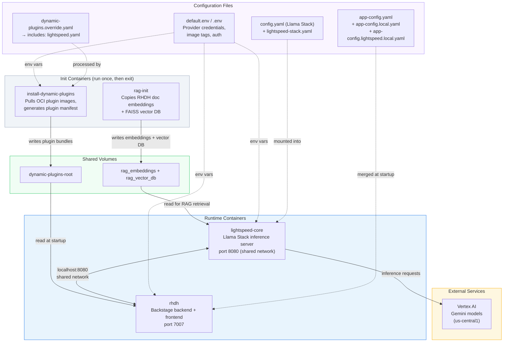
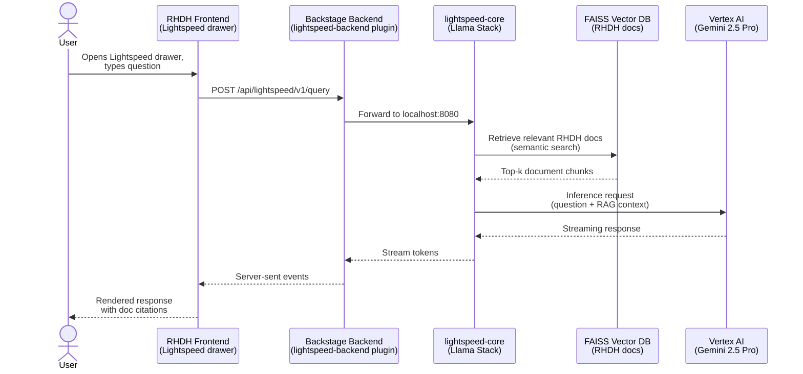
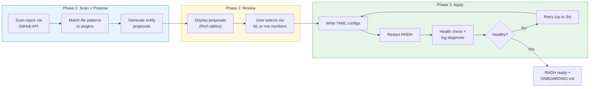

# Agentic RHDH Local

> An AI-powered CLI that automates Red Hat Developer Hub onboarding. Users provide their GitHub repo URLs — the agent scans them, recommends plugins, generates catalog entities, writes the config, and restarts RHDH.

Built on the [Anthropic Messages API](https://docs.anthropic.com/en/docs/build-with-claude/tool-use/overview) (tool-use loop) and [RHDH Local](https://github.com/redhat-developer/rhdh-local).

> [!CAUTION]
>
> This is a **proof-of-concept** — not production software.
> It is built on top of RHDH Local, which is itself for development and testing only.

## The Problem

Getting started with RHDH requires figuring out which plugins match your tech stack, writing the correct `pluginConfig` YAML, creating Backstage catalog entities with the right annotations, and debugging config errors on restart. This is error-prone and requires deep RHDH knowledge before seeing any value.

## The Solution

A single command where the user's only job is to provide their repos:

```
$ agentic-rhdh

╔═══════════════════════════════════════════════════════════════╗
║  Agentic RHDH Local — Smart Onboarding                       ║
╚═══════════════════════════════════════════════════════════════╝

Add your team's repositories:
  > https://github.com/redhat-developer/rhdh-operator   ✓

✓ Loaded 84 plugins from catalog index
✓ Claude client ready

Scanning repositories...
  ├── Scanning redhat-developer/rhdh-operator...
  │   Found 363 files
  │   Checking languages...
  │   Reading README.md...

Proposed Plugins (7):
╭─────┬──────────────────────────┬────────────────┬──────────────────────────────────────╮
│ #   │ Plugin                   │ Category       │ Reason                               │
├─────┼──────────────────────────┼────────────────┼──────────────────────────────────────┤
│ 1   │ TechDocs                 │ Documentation  │ Rich docs/ directory with 10+ files  │
│ 2   │ Adoption Insights        │ Analytics      │ Platform usage metrics dashboard     │
│ 3   │ Notifications            │ Notifications  │ In-app notification system            │
│ 4   │ GitHub Actions           │ CI/CD          │ 14 workflows — nightly, PR tests     │
│ 5   │ GitHub Pull Requests     │ Source Control │ Active PR template + CODEOWNERS      │
│ 6   │ GitHub Insights          │ Source Control │ Language breakdown, contributors     │
│ 7   │ Security Insights        │ Security       │ Dependabot alerts, advisories        │
╰─────┴──────────────────────────┴────────────────┴──────────────────────────────────────╯

  Which plugins? (all): all

Applying configuration...
  ├── Writing dynamic-plugins.override.yaml... ✓
  ├── Writing catalog entities... ✓
  ├── Restarting RHDH... ✓
  └── Health check passed ✓

╭──────────────────────────────────────────────────────────────╮
│ RHDH is ready at http://localhost:7007                        │
│ 7 plugins enabled, 1 catalog entity added                    │
│                                                              │
│ Onboarding summary saved to ONBOARDING.md                    │
╰──────────────────────────────────────────────────────────────╯
```

---

## Architecture

### Container Stack

Four containers work together to run RHDH with Lightspeed AI assistance:



**How the containers work:**

The system starts in two parallel tracks. On the plugin track, `install-dynamic-plugins` reads `dynamic-plugins.override.yaml` (which includes the Lightspeed plugins via an `includes:` chain), pulls any OCI plugin images not already cached, and writes the generated manifest to the `dynamic-plugins-root` volume. Once it exits, `rhdh` starts — it waits for the manifest, then merges the configuration chain in order:

```
app-config.yaml → app-config.patched.yaml → app-config.local.yaml
→ app-config.lightspeed.local.yaml → app-config.dynamic-plugins.yaml
```

On the AI track, `rag-init` copies pre-built sentence-transformer embeddings and a FAISS vector database (containing RHDH 1.9 product documentation) into shared volumes. Once both `rhdh` and `rag-init` complete, `lightspeed-core` starts. It shares the `rhdh` container's network namespace (`network_mode: service:rhdh`), so it listens on `localhost:8080` — directly reachable from the Backstage backend without any external networking.

All containers read environment variables from `default.env` (defaults) and `.env` (machine-specific overrides like credential paths). The `.env` file also sets `VERTEX_AI_CREDENTIALS_PATH`, which the compose file uses to mount the GCP credentials JSON into `lightspeed-core` at `/app-root/credentials.json`.

### Lightspeed + Vertex AI

Developer Lightspeed provides an AI assistant directly in the RHDH UI. Here's how a chat request flows through the system:



**How Lightspeed works:**

Lightspeed is built on [Llama Stack](https://github.com/meta-llama/llama-stack), an inference server that routes requests to configurable LLM providers. The provider is selected via environment variables in `default.env`:

```
ENABLE_VERTEX_AI=true        # activates the vertexai provider
VERTEX_AI_PROJECT=...        # your GCP project ID
VERTEX_AI_LOCATION=us-central1  # must be a real region, not 'global'
```

Llama Stack's config uses conditional expansion (`${env.ENABLE_VERTEX_AI:+vertexai}`) — providers with an empty `ENABLE_*` variable are silently skipped. This means a single `config.yaml` supports all four providers (Vertex AI, vLLM, Ollama, OpenAI) with only env var changes.

Every chat request passes through Llama Stack's RAG pipeline before reaching the LLM. The `rag-init` container pre-loads RHDH product documentation as vector embeddings, so Lightspeed answers questions with context from the actual docs — not just the model's training data.

The Lightspeed frontend and backend plugins are loaded via the dynamic plugins `includes:` chain. A persistent file (`configs/dynamic-plugins/dynamic-plugins.lightspeed.yaml`) is included by every `dynamic-plugins.override.yaml` the agent generates, so Lightspeed survives `agentic-rhdh reset` — no reconfiguration needed.

**Credential flow:**

```
~/.config/gcloud/application_default_credentials.json  (host)
    ↓  mounted via VERTEX_AI_CREDENTIALS_PATH in .env
/app-root/credentials.json  (inside lightspeed-core container)
    ↓  referenced by GOOGLE_APPLICATION_CREDENTIALS env var
Vertex AI SDK authenticates to GCP
```

### Agentic Onboarding

The onboarding agent runs a three-phase pipeline in a single conversation — context from scanning carries through to config writing:



**How the agent works:**

The agent is built on the [Anthropic Messages API tool-use loop](https://platform.claude.com/docs/en/agents-and-tools/tool-use/overview): send a request to Claude, receive tool calls, execute them locally, return results, repeat until Claude stops calling tools. The architecture follows patterns from Anthropic's [Building Effective Agents](https://www.anthropic.com/research/building-effective-agents) guide.

A single unified system prompt encodes four specialist roles — repo scanner, plugin recommender, entity generator, and config writer. Claude switches roles naturally as it progresses through the pipeline. This avoids the context loss we found with separate specialist agents, where the recommender didn't have the scanner's full understanding of the repo.

**Knowledge base, not hallucination.** Plugin recommendations come from a knowledge base of 84 plugins extracted from the RHDH catalog index OCI image (`quay.io/rhdh/plugin-catalog-index:1.9`). The agent looks up exact package references, `pluginConfig` blocks, and mount point definitions — it never generates these from training data.

**Self-healing apply loop.** After writing config and restarting RHDH, the agent checks container health and parses logs for plugin errors. If it finds a problem (missing env var, bad YAML, failed OCI pull), it diagnoses the root cause, fixes the config, and retries — up to 3 times. If a plugin still fails, the agent disables it and reports the specific failure rather than silently giving up.

**The agent restarts RHDH using the same compose infrastructure** — `podman compose down && podman compose up -d` with the Lightspeed overlay automatically included. This means the self-heal cycle exercises the full container startup, not just a process restart.

---

## Quick Start

### Prerequisites

- Python 3.11+
- [Podman](https://podman.io/docs/installation) v5.4.1+ or [Docker](https://docs.docker.com/engine/) v28.1.0+ with Compose
- Claude API access — either:
  - **Vertex AI**: `CLAUDE_CODE_USE_VERTEX=1` + `ANTHROPIC_VERTEX_PROJECT_ID`
  - **Direct**: `ANTHROPIC_API_KEY`
- GitHub auth: [`gh` CLI](https://cli.github.com/) (`gh auth login`) or `GITHUB_TOKEN` env var
- **For Lightspeed** (optional): GCP credentials (`gcloud auth application-default login`)

### Run

```sh
git clone https://github.com/Fortune-Ndlovu/agentic-rhdh-local.git
cd agentic-rhdh-local

# Start RHDH + Lightspeed (compose.override.yaml auto-includes lightspeed-core)
podman compose up -d

# Install the agentic CLI
pip install -e .

# Configure Claude API access
# Option A: Vertex AI
export CLAUDE_CODE_USE_VERTEX=1
export ANTHROPIC_VERTEX_PROJECT_ID=your-gcp-project

# Option B: Direct Anthropic API
export ANTHROPIC_API_KEY=sk-ant-...

# Run the onboarding agent
agentic-rhdh
```

### Commands

```sh
agentic-rhdh                          # Run onboarding
agentic-rhdh reset                    # Remove generated config, restore baseline
agentic-rhdh --project-dir /path/to   # Use a different project directory
```

Access RHDH at [http://localhost:7007](http://localhost:7007).

---

## Project Structure

```
agentic-rhdh-local/
├── agentic/                          # AI-powered onboarding agent
│   ├── __main__.py                   # CLI entry point (Typer)
│   ├── agents/                       # Agent prompt, session loop, tool schemas
│   ├── knowledge/                    # Plugin index, signal map, catalog extractor
│   ├── tools/                        # GitHub API, YAML writer, compose, health check
│   └── ui/                           # Rich TUI — input, proposals, review, completion
├── compose.yaml                      # Base containers (rhdh, install-dynamic-plugins)
├── compose.override.yaml             # → symlink to developer-lightspeed/compose.yaml
├── developer-lightspeed/             # Lightspeed stack
│   ├── compose.yaml                  # Adds rag-init + lightspeed-core containers
│   └── configs/                      # Llama Stack config, RAG profile, app-config overlay
├── configs/
│   ├── dynamic-plugins/              # Plugin configs (default + override + lightspeed)
│   ├── catalog-entities/             # Catalog entity YAML + TechDocs (agent-generated)
│   └── app-config/                   # RHDH app config (base + local overrides)
├── default.env                       # Default env vars (providers, auth, images)
├── .env                              # Machine-specific overrides (credential paths)
└── ONBOARDING.md                     # Generated onboarding summary (after agent run)
```

---

<details>
<summary><strong>Signal Detection</strong> — file patterns the agent recognizes</summary>

| Signal | File Patterns | Maps To |
|--------|--------------|---------|
| GitHub Actions | `.github/workflows/*.yml` | github-actions plugin |
| GitHub Pull Requests | `.github/**/*` | github-pull-requests plugin |
| GitHub Insights | `.github/**/*` | github-insights plugin |
| Security Insights | `.github/**/*` | security-insights plugin |
| Tekton | `tekton/`, `.tekton/` | tekton plugin |
| Jenkins | `Jenkinsfile` | jenkins plugin |
| ArgoCD | `argocd/`, `argoproj.io/` | argocd plugin |
| Kubernetes | `k8s/`, `deploy/`, `manifests/` | kubernetes + topology plugins |
| Helm | `Chart.yaml` | kubernetes plugin |
| Docker | `Dockerfile`, `Containerfile` | topology plugin |
| TechDocs | `mkdocs.yml`, `docs/` | techdocs plugin |
| OpenAPI | `openapi.yaml`, `swagger.json` | api-docs plugin |
| SonarQube | `sonar-project.properties` | sonarqube plugin |
| Ansible | `ansible/`, `playbooks/` | ansible plugin |
| Azure DevOps | `azure-pipelines.yml` | azure-devops plugin |

</details>

<details>
<summary><strong>RHDH Local Commands</strong></summary>

> Replace `podman` with `docker` if using Docker.

```sh
podman compose up -d                                   # Start RHDH + Lightspeed
podman compose run install-dynamic-plugins             # Re-install plugins after config change
podman compose stop rhdh && podman compose start rhdh   # Restart RHDH only
podman compose down --volumes                          # Tear down everything
```

</details>

## Additional Guides

1. [Developer Lightspeed Guide](./developer-lightspeed/README.md) — AI assistance setup and provider configuration
2. [Plugins Guide](./docs/rhdh-local-guide/plugins-guide.md) — manual plugin installation
3. [Container Image Guide](docs/rhdh-local-guide/container-image-guide.md) — switching RHDH versions
4. [PostgreSQL Guide](docs/rhdh-local-guide/postgresql-guide.md) — persistent database
5. [Orchestrator Workflow Guide](./orchestrator/README.md) — workflow development

## License

```
Copyright Red Hat

Licensed under the Apache License, Version 2.0 (the "License");
you may not use this file except in compliance with the License.
You may obtain a copy of the License at

   http://www.apache.org/licenses/LICENSE-2.0

Unless required by applicable law or agreed to in writing, software
distributed under the License is distributed on an "AS IS" BASIS,
WITHOUT WARRANTIES OR CONDITIONS OF ANY KIND, either express or implied.
See the License for the specific language governing permissions and
limitations under the License.
```
