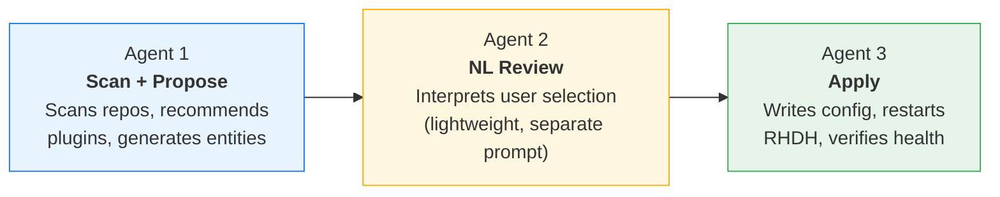
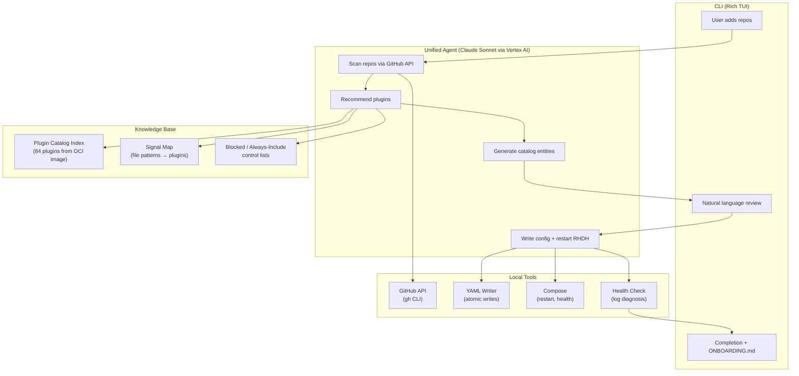
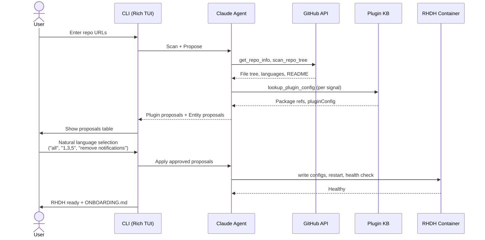
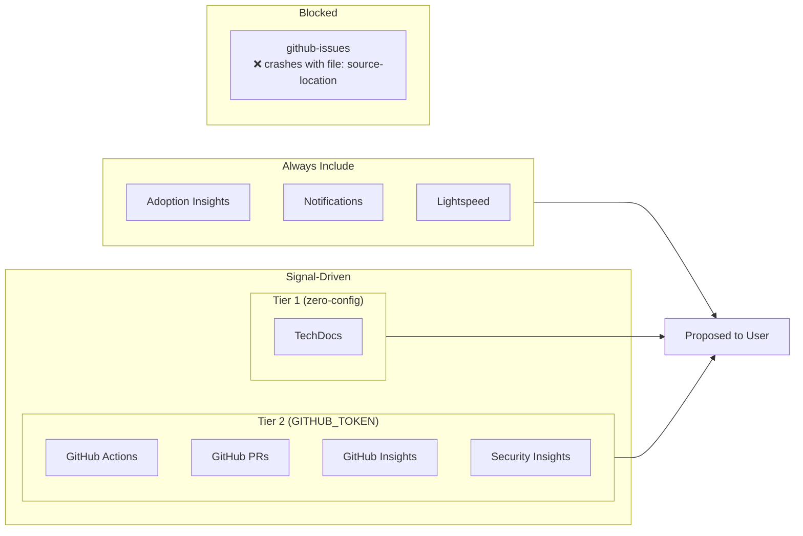
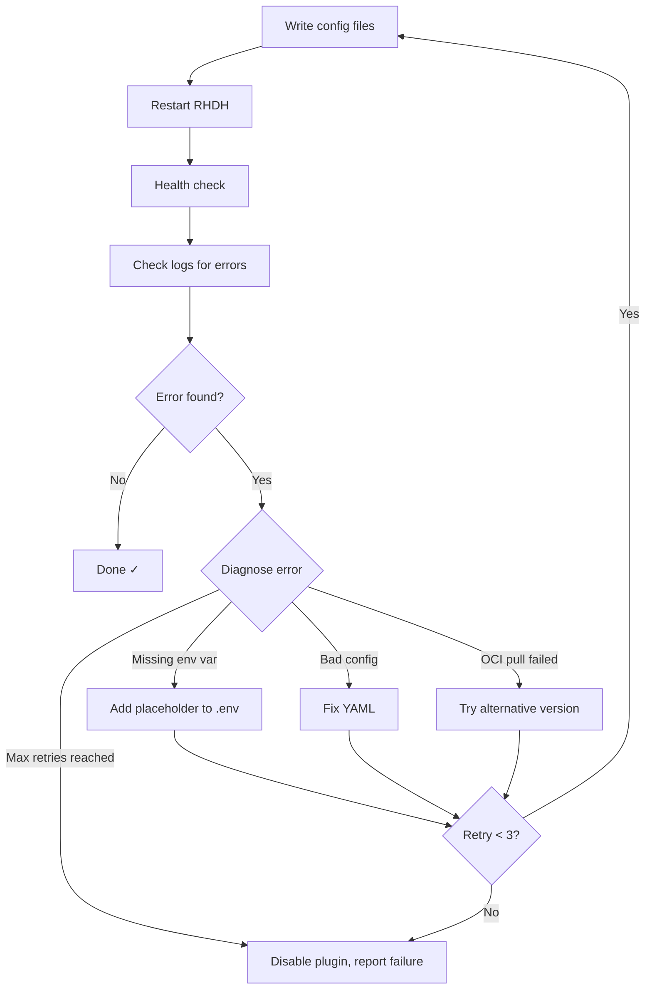

# Agentic RHDH Local

> An AI-powered CLI that automates Red Hat Developer Hub onboarding. Instead of manually discovering plugins, writing YAML configs, and creating catalog entities, users provide their GitHub repo URLs and the agent does the rest.

Built on the [Anthropic Messages API](https://docs.anthropic.com/en/docs/build-with-claude/tool-use/overview) (tool-use loop) and [RHDH Local](https://github.com/redhat-developer/rhdh-local).

> [!CAUTION]
>
> This is a **proof-of-concept** — not production software.
> It is built on top of RHDH Local, which is itself for development and testing only.

## The Problem

Getting started with RHDH is painful. A platform engineer who wants to onboard their team's repositories must:

1. Figure out which dynamic plugins match their tech stack (GitHub Actions? Tekton? ArgoCD? Kubernetes?)
2. Write the correct `pluginConfig` YAML blocks with mount points, routes, and env vars
3. Create Backstage catalog entities for each repo with the right annotations
4. Configure `app-config` to point at the right catalog locations
5. Install plugins, restart RHDH, debug config errors, repeat

This is error-prone, time-consuming, and requires deep RHDH knowledge before seeing any value.

## The Solution

A single unified agent where the user's only job is to say: **"here are my repos."**

```
$ agentic-rhdh

╔══════════════════════════════════════════════════════════════════════════════╗
║                                                                            ║
║  Agentic RHDH Local — Smart Onboarding                                     ║
║                                                                            ║
╚══════════════════════════════════════════════════════════════════════════════╝

Add your team's repositories:

  > https://github.com/redhat-developer/rhdh-operator   ✓

✓ Loaded 84 plugins from catalog index
✓ Claude client ready

Scanning repositories...
  ├── Scanning redhat-developer/rhdh-operator...
  │   Found 363 files
  │   Checking languages...
  │   Reading README.md...

Proposed Plugins (8):
╭─────┬──────────────────────────┬────────────────┬──────────────────────────────────────────╮
│ #   │ Plugin                   │ Category       │ Reason                                   │
├─────┼──────────────────────────┼────────────────┼──────────────────────────────────────────┤
│ 1   │ TechDocs                 │ Documentation  │ Rich docs/ directory with 10+ files      │
│ 2   │ Adoption Insights        │ Analytics      │ Platform usage metrics dashboard         │
│ 3   │ Notifications            │ Notifications  │ In-app notification system                │
│ 4   │ Lightspeed               │ AI Assistant   │ AI assistant for Developer Hub            │
│ 5   │ GitHub Actions           │ CI/CD          │ 14 workflows — nightly builds, PR tests   │
│ 6   │ GitHub Pull Requests     │ Source Control │ Active PR template + CODEOWNERS           │
│ 7   │ GitHub Insights          │ Source Control │ Language breakdown, contributors, license  │
│ 8   │ Security Insights        │ Security       │ Dependabot alerts, security advisories    │
╰─────┴──────────────────────────┴────────────────┴──────────────────────────────────────────╯

  Options: all, none, pick by row number (e.g. 1,4,5), or natural language (e.g. "remove notifications")
  Which plugins? (all): all

Applying configuration...
  ├── Writing dynamic-plugins.override.yaml... ✓
  ├── Writing catalog entities... ✓
  ├── Restarting RHDH... ✓
  └── Health check passed ✓

╭──────────────────────────────────────────────────────────────────────╮
│ RHDH is ready at http://localhost:7007                              │
│ 8 plugins enabled, 1 catalog entities added                        │
│                                                                    │
│ Onboarding summary saved to ONBOARDING.md                          │
╰──────────────────────────────────────────────────────────────────────╯
```

## Agentic Pattern

This project implements patterns from Anthropic's [Building Effective Agents](https://www.anthropic.com/research/building-effective-agents) guide. Rather than using a single pattern, we combine three:

### 1. Augmented LLM (the building block)

Each agent is an [augmented LLM](https://platform.claude.com/docs/en/agents-and-tools/tool-use/overview) — Claude enhanced with retrieval (plugin knowledge base injected into the system prompt) and 13 local tools (GitHub API, YAML writer, health checks, etc.). The core loop is the canonical [agentic tool-use loop](https://platform.claude.com/docs/en/agents-and-tools/tool-use/how-tool-use-works): send a request, Claude responds with tool calls, execute tools locally, return results, repeat until `stop_reason != "tool_use"`.

### 2. Prompt chaining (the workflow)

The onboarding pipeline is a [prompt chain](https://www.anthropic.com/research/building-effective-agents) — multiple agent calls connected sequentially, where the output of one step feeds the next:



| Agent | System Prompt | Model | Purpose |
|-------|--------------|-------|---------|
| **Scan + Propose** | Unified prompt with 4 specialist roles (scanner, recommender, entity generator, config writer) | Claude Sonnet | Scan repos via GitHub API, match signals to plugins, generate catalog entities |
| **NL Review** | Lightweight intent parser ("return JSON array of numbers to keep") | Claude Sonnet | Interpret natural language plugin selection — only called when local parsing can't handle the input |
| **Apply** | Same unified prompt (continues the conversation from Agent 1) | Claude Sonnet | Write override YAML, restart RHDH, diagnose errors, retry up to 3 times |

### 3. Multi-role system prompt (the knowledge)

Instead of separate specialist agents (which we tried first and found lossy), the unified system prompt encodes four specialist roles in one context. The agent switches roles naturally as it progresses through the pipeline — scanning like a repo scanner, recommending like a plugin expert, generating entities like a Backstage specialist, and writing config like an RHDH operator.

### Why this hybrid over pure multi-agent?

We started with a 4-agent orchestrator-workers pattern (scanner → recommender → entity generator → config writer) but found:

- **Context loss** — the recommender didn't have the scanner's full understanding of the repo
- **Coordination overhead** — the orchestrator spent tokens routing and summarizing between specialists
- **Prompt chaining** gave us the sequencing benefit of multi-agent without the context handoff cost

### Further reading

- [Building Effective Agents](https://www.anthropic.com/research/building-effective-agents) — Anthropic's guide to agent architecture patterns (prompt chaining, routing, orchestrator-workers)
- [Tool Use Overview](https://platform.claude.com/docs/en/agents-and-tools/tool-use/overview) — How Claude tool use works
- [How Tool Use Works](https://platform.claude.com/docs/en/agents-and-tools/tool-use/how-tool-use-works) — The agentic loop in detail
- [Multi-Agent Research System](https://www.anthropic.com/engineering/multi-agent-research-system) — Anthropic's case study on when multi-agent IS warranted
- [Claude Agent SDK](https://code.claude.com/docs/en/agent-sdk/overview) — Anthropic's SDK for building agents

## Architecture

A unified agent powered by Claude (via Vertex AI or direct API), using a tool-use loop to scan repos, recommend plugins, generate catalog entities, and write config — all in a single conversation turn.



### Onboarding Flow



### Plugin Selection



## Key Features

| Feature | Description |
|---------|-------------|
| **Unified agent** | Single Claude agent handles the full pipeline — no multi-agent coordination overhead |
| **Plugin knowledge base** | 84 plugins indexed from `quay.io/rhdh/plugin-catalog-index:1.9` — real configs, not hallucinated |
| **Signal detection** | File patterns in repos map to plugin recommendations with confidence levels |
| **Always-include plugins** | Adoption Insights, Notifications, and Lightspeed proposed on every onboarding |
| **Blocked plugins** | `github-issues` blocked (crashes with `file:` source-location entities) |
| **Natural language review** | "remove notifications", "only keep GitHub Actions", "1,3,5" — local keyword parsing + Claude fallback |
| **Owner detection** | Reads `users.yaml` to set component owner to the signed-in GitHub user |
| **Onboarding doc** | `ONBOARDING.md` generated with plugin table, config locations, and next steps |
| **Reset** | `agentic-rhdh reset` removes all generated files and restores baseline |
| **Resilient apply** | Config writer retries up to 3 times with log-based error diagnosis |

## Quick Start

### Prerequisites

- Python 3.11+
- [Podman](https://podman.io/docs/installation) v5.4.1+ or [Docker](https://docs.docker.com/engine/) v28.1.0+ with Compose
- Claude API access — either:
  - **Vertex AI**: `CLAUDE_CODE_USE_VERTEX=1` + `ANTHROPIC_VERTEX_PROJECT_ID` (GCP billing)
  - **Direct**: `ANTHROPIC_API_KEY`
- GitHub auth via [`gh` CLI](https://cli.github.com/) (`gh auth login`) or `GITHUB_TOKEN` env var

### Run

```sh
# Clone and start RHDH Local
git clone https://github.com/Fortune-Ndlovu/agentic-rhdh-local.git
cd agentic-rhdh-local
podman compose up -d  # or: docker compose up -d

# Install the agentic CLI
pip install -e .

# Option A: Vertex AI (GCP billing)
export CLAUDE_CODE_USE_VERTEX=1
export ANTHROPIC_VERTEX_PROJECT_ID=your-gcp-project

# Option B: Direct Anthropic API
export ANTHROPIC_API_KEY=sk-ant-...

# Run the onboarding agent
agentic-rhdh
```

### Commands

```sh
agentic-rhdh                          # Run onboarding
agentic-rhdh reset                    # Remove all generated config, restore baseline
agentic-rhdh --project-dir /path/to   # Use a different project directory
```

## Project Structure

```
agentic-rhdh-local/
├── agentic/                        # AI-powered onboarding system (Python)
│   ├── __main__.py                 # CLI entry point (Typer)
│   ├── models.py                   # Pydantic data models
│   ├── agents/                     # Agent definitions
│   │   ├── client.py               # Client factory (auto-detects Vertex AI or direct API)
│   │   ├── prompts.py              # System prompt with plugin selection policy
│   │   ├── session.py              # Tool-use loop (Messages API)
│   │   └── tools.py                # Tool JSON Schema definitions
│   ├── knowledge/                  # Plugin knowledge base
│   │   ├── extractor.py            # Extracts catalog index image (podman/docker)
│   │   ├── plugin_index.py         # PluginKnowledgeBase — 84 plugins indexed
│   │   └── signal_map.py           # File patterns → plugins, blocked/always-include lists
│   ├── tools/                      # Local tool implementations
│   │   ├── github.py               # GitHub API (gh CLI / GITHUB_TOKEN fallback)
│   │   ├── yaml_writer.py          # Atomic YAML writes with backup
│   │   ├── compose.py              # Podman/Docker compose operations
│   │   └── health_check.py         # RHDH health check + log-based error diagnosis
│   └── ui/                         # CLI interface
│       └── app.py                  # Rich TUI — input, proposals, NL review, onboarding doc
├── pyproject.toml                  # Python project config
├── compose.yaml                    # RHDH Local container orchestration
├── default.env                     # Default env vars (Lightspeed, GitHub auth, DB)
├── configs/                        # RHDH configuration (agent writes overrides here)
│   ├── dynamic-plugins/            # Plugin configs (default + override)
│   ├── catalog-entities/           # Catalog entity YAML + TechDocs
│   └── app-config/                 # App config YAML
├── ONBOARDING.md                   # Generated onboarding summary (after running agent)
└── ...                             # RHDH Local base files (scripts, docs, etc.)
```

## Tech Stack

| Component | Technology | Why |
|-----------|-----------|-----|
| Language | Python 3.11+ | Clean SDK support, strong YAML/JSON tooling, fast iteration |
| Agent Runtime | Anthropic Messages API (tool-use loop) | Single agent, local tool dispatch, no server-side state |
| Model | Claude Sonnet 4.6 (via Vertex AI or direct) | Strong tool use, cost-effective, auto-detected auth |
| CLI Framework | Rich + Typer | Interactive TUI with tables, progress, prompts |
| Data Models | Pydantic v2 | Typed, validated, serializable |
| Plugin Data | RHDH Catalog Index Image | Authoritative source, version-matched, no vector DB |
| Container Runtime | Podman/Docker (auto-detected) | For RHDH lifecycle management |

## Signals Detected

The agent recognizes these technologies from repo file patterns:

| Signal | File Patterns | Maps To |
|--------|--------------|---------|
| GitHub Actions | `.github/workflows/*.yml` | github-actions plugin |
| GitHub Pull Requests | `.github/**/*` | github-pull-requests plugin |
| GitHub Insights | `.github/**/*` | github-insights plugin |
| Security Insights | `.github/**/*` | security-insights plugin |
| Tekton | `tekton/`, `.tekton/`, `apiVersion: tekton.dev/` | tekton plugin |
| Jenkins | `Jenkinsfile` | jenkins plugin |
| ArgoCD | `argocd/`, `argoproj.io/` | argocd plugin |
| Kubernetes | `k8s/`, `deploy/`, `manifests/`, `apiVersion: apps/v1` | kubernetes + topology plugins |
| Helm | `Chart.yaml` | kubernetes plugin |
| Docker | `Dockerfile`, `Containerfile` | topology plugin |
| TechDocs | `mkdocs.yml`, `docs/` | techdocs plugin |
| OpenAPI | `openapi.yaml`, `swagger.json` | api-docs plugin |
| SonarQube | `sonar-project.properties` | sonarqube plugin |
| Ansible | `ansible/`, `playbooks/`, `roles/` | ansible-plugin |
| Azure DevOps | `azure-pipelines.yml` | azure-devops plugin |
| Existing Backstage | `catalog-info.yaml` | Direct import |

## Config Writer Resilience

The agent doesn't just write files and hope for the best. It follows a resilience loop:



## RHDH Local Commands

> Replace `podman` with `docker` if using Docker.

```sh
# Start RHDH
podman compose up -d

# After plugin config changes
podman compose run install-dynamic-plugins
podman compose stop rhdh && podman compose start rhdh

# Quick restart (config-only changes)
podman compose restart rhdh

# Tear down
podman compose down --volumes
```

Access RHDH at [http://localhost:7007](http://localhost:7007) (login as Guest).

## Additional Guides

1. [Plugins Guide](./docs/rhdh-local-guide/plugins-guide.md) — manual plugin installation
2. [Container Image Guide](docs/rhdh-local-guide/container-image-guide.md) — switching RHDH versions
3. [Simulated Proxy Setup](docs/rhdh-local-guide/corporate-proxy-setup-sim.md) — proxy testing
4. [PostgreSQL Guide](docs/rhdh-local-guide/postgresql-guide.md) — persistent database
5. [Orchestrator Workflow Guide](./orchestrator/README.md) — workflow development
6. [Developer Lightspeed Guide](./developer-lightspeed/README.md) — AI assistance in RHDH

## License

```txt
Copyright Red Hat

Licensed under the Apache License, Version 2.0 (the "License");
you may not use this file except in compliance with the License.
You may obtain a copy of the License at

   http://www.apache.org/licenses/LICENSE-2.0

Unless required by applicable law or agreed to in writing, software
distributed under the License is distributed on an "AS IS" BASIS,
WITHOUT WARRANTIES OR CONDITIONS OF ANY KIND, either express or implied.
See the License for the specific language governing permissions and
limitations under the License.
```
