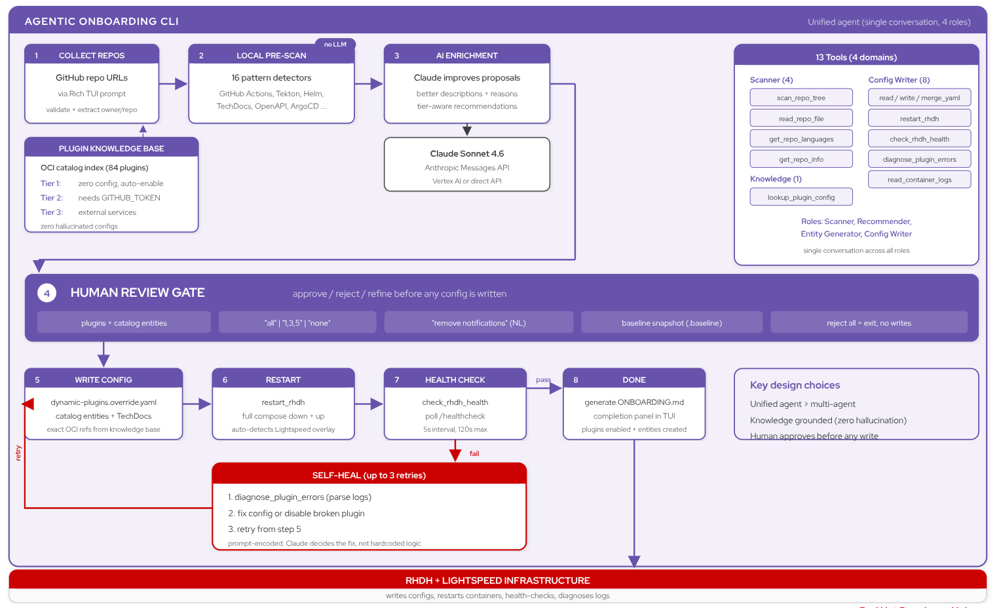

# Agentic RHDH Local

> An AI-powered CLI that automates Red Hat Developer Hub onboarding. Users provide their GitHub repo URLs — the agent scans them, recommends plugins, generates catalog entities, writes the config, and restarts RHDH.

Built on the [Anthropic Messages API](https://docs.anthropic.com/en/docs/build-with-claude/tool-use/overview) (tool-use loop) and [RHDH Local](https://github.com/redhat-developer/rhdh-local).

> [!CAUTION]
>
> This is a **proof-of-concept** — not production software.
> It is built on top of RHDH Local, which is itself for development and testing only.

## The Problem

Getting started with RHDH requires figuring out which plugins match your tech stack, writing the correct `pluginConfig` YAML, creating Backstage catalog entities with the right annotations, and debugging config errors on restart. This can be error-prone and requires head-down time before figuring out what works best.

## The Solution

A single command where the user's only job is to provide their repos:

```
$ agentic-rhdh

╔═══════════════════════════════════════════════════════════════╗
║  Agentic RHDH Local — Smart Onboarding                        ║
╚═══════════════════════════════════════════════════════════════╝

Add your team's repositories:
  > https://github.com/redhat-developer/rhdh-operator   ✓

✓ Loaded 84 plugins from catalog index
✓ Claude client ready

Scanning repositories...
  ├── Scanning redhat-developer/rhdh-operator...
  │   Found 363 files
  │   Checking languages...
  │   Reading README.md...

Proposed Plugins (7):
╭─────┬──────────────────────────┬────────────────┬──────────────────────────────────────╮
│ #   │ Plugin                   │ Category       │ Reason                               │
├─────┼──────────────────────────┼────────────────┼──────────────────────────────────────┤
│ 1   │ TechDocs                 │ Documentation  │ Rich docs/ directory with 10+ files  │
│ 2   │ Adoption Insights        │ Analytics      │ Platform usage metrics dashboard     │
│ 3   │ Notifications            │ Notifications  │ In-app notification system           │
│ 4   │ GitHub Actions           │ CI/CD          │ 14 workflows — nightly, PR tests     │
│ 5   │ GitHub Pull Requests     │ Source Control │ Active PR template + CODEOWNERS      │
│ 6   │ GitHub Insights          │ Source Control │ Language breakdown, contributors     │
│ 7   │ Security Insights        │ Security       │ Dependabot alerts, advisories        │
╰─────┴──────────────────────────┴────────────────┴──────────────────────────────────────╯

  Which plugins? (all): all

Applying configuration...
  ├── Writing dynamic-plugins.override.yaml... ✓
  ├── Writing catalog entities... ✓
  ├── Restarting RHDH... ✓
  └── Health check passed ✓

╭──────────────────────────────────────────────────────────────╮
│ RHDH is ready at http://localhost:7007                        │
│ 7 plugins enabled, 1 catalog entity added                    │
│                                                              │
│ Onboarding summary saved to ONBOARDING.md                    │
╰──────────────────────────────────────────────────────────────╯
```

---

## Quick Start

### Prerequisites

- Python 3.11+
- [Podman](https://podman.io/docs/installation) v5.4.1+ or [Docker](https://docs.docker.com/engine/) v28.1.0+ with Compose
- Claude API access — either:
  - **Vertex AI**: `CLAUDE_CODE_USE_VERTEX=1` + `ANTHROPIC_VERTEX_PROJECT_ID`
  - **Direct**: `ANTHROPIC_API_KEY`
- GitHub auth: [`gh` CLI](https://cli.github.com/) (`gh auth login`) or `GITHUB_TOKEN` env var
- **For Lightspeed** (optional): GCP credentials (`gcloud auth application-default login`)

### Run

```sh
git clone https://github.com/Fortune-Ndlovu/agentic-rhdh-local.git
cd agentic-rhdh-local

# Start RHDH + Lightspeed (compose.override.yaml auto-includes lightspeed-core)
podman compose up -d

# Install the agentic CLI
pip install -e .

# Configure Claude API access
# Option A: Vertex AI
export CLAUDE_CODE_USE_VERTEX=1
export ANTHROPIC_VERTEX_PROJECT_ID=your-gcp-project

# Option B: Direct Anthropic API
export ANTHROPIC_API_KEY=sk-ant-...

# Run the onboarding agent
agentic-rhdh
```

### Commands

```sh
agentic-rhdh                          # Run onboarding
agentic-rhdh reset                    # Remove generated config, restore baseline
agentic-rhdh --project-dir /path/to   # Use a different project directory
```

### RHDH Local Commands

> Replace `podman` with `docker` if using Docker.

```sh
podman compose up -d                                   # Start RHDH + Lightspeed
podman compose run install-dynamic-plugins             # Re-install plugins after config change
podman compose stop rhdh && podman compose start rhdh  # Restart RHDH only
podman compose down --volumes                          # Tear down everything
```

Access RHDH at [http://localhost:7007](http://localhost:7007).

---

## Agentic Onboarding CLI

The `agentic-rhdh` command is a Python CLI (`agentic/`) that automates RHDH onboarding from GitHub repository URLs. It runs alongside RHDH Local and Developer Lightspeed — it does not replace them.



### How it works

1. **Knowledge base** — extracts the RHDH plugin catalog index (~84 plugins) from the OCI image so recommendations are grounded, not hallucinated
2. **Local pre-scan** — matches repo file patterns (GitHub Actions, TechDocs, Kubernetes, etc.) to plugins without LLM calls
3. **AI enrichment** — Claude improves proposal reasons with repo-specific context
4. **Human review** — you approve plugins and catalog entities before any config is written
5. **Apply + self-heal** — writes `dynamic-plugins.override.yaml` and entity YAML, restarts compose, health-checks, and retries on failure
6. **Summary** — writes `ONBOARDING.md` with enabled plugins and any required env vars

The agent only writes the **override layer** — default plugins, Lightspeed config, and extensions survive `agentic-rhdh reset`.

### Source layout

```
agentic/
├── agents/      # prompts, tool-use loop, Claude client
├── knowledge/   # OCI catalog extraction, plugin index, signal map
├── tools/       # compose, GitHub API, YAML I/O, health checks
├── scanner.py   # local pre-scan
└── ui/          # Rich TUI
```

---

## Additional Guides

1. [Developer Lightspeed Guide](./developer-lightspeed/README.md) — AI assistance setup and provider configuration
2. [Plugins Guide](./docs/rhdh-local-guide/plugins-guide.md) — manual plugin installation
3. [Container Image Guide](docs/rhdh-local-guide/container-image-guide.md) — switching RHDH versions
4. [PostgreSQL Guide](docs/rhdh-local-guide/postgresql-guide.md) — persistent database
5. [Orchestrator Workflow Guide](./orchestrator/README.md) — workflow development

## License

```
Copyright Red Hat

Licensed under the Apache License, Version 2.0 (the "License");
you may not use this file except in compliance with the License.
You may obtain a copy of the License at

   http://www.apache.org/licenses/LICENSE-2.0

Unless required by applicable law or agreed to in writing, software
distributed under the License is distributed on an "AS IS" BASIS,
WITHOUT WARRANTIES OR CONDITIONS OF ANY KIND, either express or implied.
See the License for the specific language governing permissions and
limitations under the License.
```
