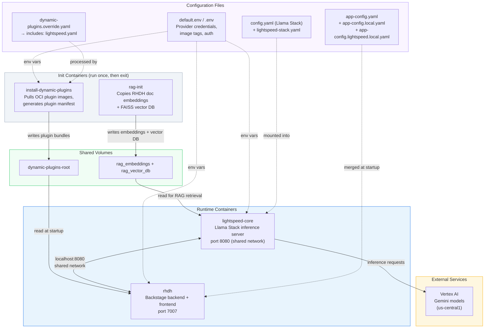
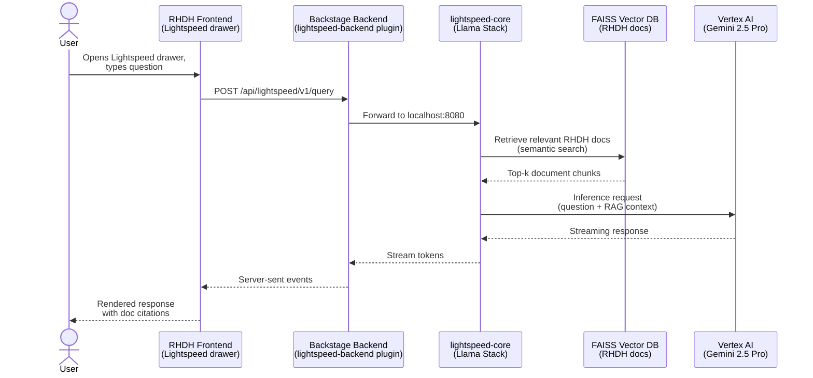
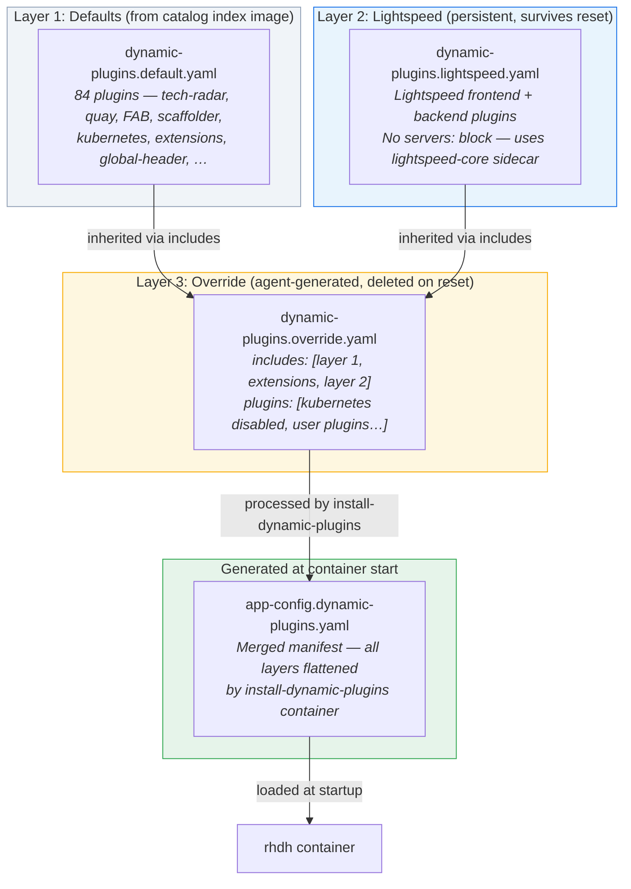
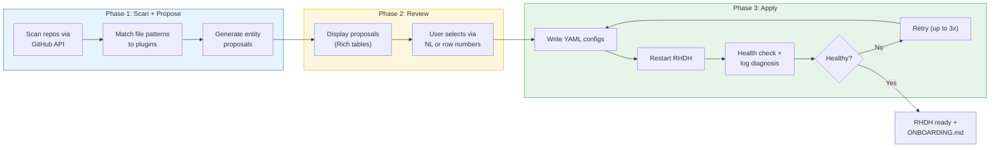

# Agentic RHDH Local

> An AI-powered CLI that automates Red Hat Developer Hub onboarding. Users provide their GitHub repo URLs — the agent scans them, recommends plugins, generates catalog entities, writes the config, and restarts RHDH.

Built on the [Anthropic Messages API](https://docs.anthropic.com/en/docs/build-with-claude/tool-use/overview) (tool-use loop) and [RHDH Local](https://github.com/redhat-developer/rhdh-local).

> [!CAUTION]
>
> This is a **proof-of-concept** — not production software.
> It is built on top of RHDH Local, which is itself for development and testing only.

## The Problem

Getting started with RHDH requires figuring out which plugins match your tech stack, writing the correct `pluginConfig` YAML, creating Backstage catalog entities with the right annotations, and debugging config errors on restart. This can be error-prone and requires head-down time before figuring out what works best.

## The Solution

A single command where the user's only job is to provide their repos:

```
$ agentic-rhdh

╔═══════════════════════════════════════════════════════════════╗
║  Agentic RHDH Local — Smart Onboarding                        ║
╚═══════════════════════════════════════════════════════════════╝

Add your team's repositories:
  > https://github.com/redhat-developer/rhdh-operator   ✓

✓ Loaded 84 plugins from catalog index
✓ Claude client ready

Scanning repositories...
  ├── Scanning redhat-developer/rhdh-operator...
  │   Found 363 files
  │   Checking languages...
  │   Reading README.md...

Proposed Plugins (7):
╭─────┬──────────────────────────┬────────────────┬──────────────────────────────────────╮
│ #   │ Plugin                   │ Category       │ Reason                               │
├─────┼──────────────────────────┼────────────────┼──────────────────────────────────────┤
│ 1   │ TechDocs                 │ Documentation  │ Rich docs/ directory with 10+ files  │
│ 2   │ Adoption Insights        │ Analytics      │ Platform usage metrics dashboard     │
│ 3   │ Notifications            │ Notifications  │ In-app notification system           │
│ 4   │ GitHub Actions           │ CI/CD          │ 14 workflows — nightly, PR tests     │
│ 5   │ GitHub Pull Requests     │ Source Control │ Active PR template + CODEOWNERS      │
│ 6   │ GitHub Insights          │ Source Control │ Language breakdown, contributors     │
│ 7   │ Security Insights        │ Security       │ Dependabot alerts, advisories        │
╰─────┴──────────────────────────┴────────────────┴──────────────────────────────────────╯

  Which plugins? (all): all

Applying configuration...
  ├── Writing dynamic-plugins.override.yaml... ✓
  ├── Writing catalog entities... ✓
  ├── Restarting RHDH... ✓
  └── Health check passed ✓

╭──────────────────────────────────────────────────────────────╮
│ RHDH is ready at http://localhost:7007                        │
│ 7 plugins enabled, 1 catalog entity added                    │
│                                                              │
│ Onboarding summary saved to ONBOARDING.md                    │
╰──────────────────────────────────────────────────────────────╯
```

---

## Quick Start

### Prerequisites

- Python 3.11+
- [Podman](https://podman.io/docs/installation) v5.4.1+ or [Docker](https://docs.docker.com/engine/) v28.1.0+ with Compose
- Claude API access — either:
  - **Vertex AI**: `CLAUDE_CODE_USE_VERTEX=1` + `ANTHROPIC_VERTEX_PROJECT_ID`
  - **Direct**: `ANTHROPIC_API_KEY`
- GitHub auth: [`gh` CLI](https://cli.github.com/) (`gh auth login`) or `GITHUB_TOKEN` env var
- **For Lightspeed** (optional): GCP credentials (`gcloud auth application-default login`)

### Run

```sh
git clone https://github.com/Fortune-Ndlovu/agentic-rhdh-local.git
cd agentic-rhdh-local

# Start RHDH + Lightspeed (compose.override.yaml auto-includes lightspeed-core)
podman compose up -d

# Install the agentic CLI
pip install -e .

# Configure Claude API access
# Option A: Vertex AI
export CLAUDE_CODE_USE_VERTEX=1
export ANTHROPIC_VERTEX_PROJECT_ID=your-gcp-project

# Option B: Direct Anthropic API
export ANTHROPIC_API_KEY=sk-ant-...

# Run the onboarding agent
agentic-rhdh
```

### Commands

```sh
agentic-rhdh                          # Run onboarding
agentic-rhdh reset                    # Remove generated config, restore baseline
agentic-rhdh --project-dir /path/to   # Use a different project directory
```

### RHDH Local Commands

> Replace `podman` with `docker` if using Docker.

```sh
podman compose up -d                                   # Start RHDH + Lightspeed
podman compose run install-dynamic-plugins             # Re-install plugins after config change
podman compose stop rhdh && podman compose start rhdh  # Restart RHDH only
podman compose down --volumes                          # Tear down everything
```

Access RHDH at [http://localhost:7007](http://localhost:7007).

---

## Architecture

### Container Stack

Four containers work together to run RHDH with Lightspeed AI assistance:



**How the containers work:**

The system starts in two parallel tracks. On the plugin track, `install-dynamic-plugins` reads `dynamic-plugins.override.yaml` (which includes the Lightspeed plugins via an `includes:` chain), pulls any OCI plugin images not already cached, and writes the generated manifest to the `dynamic-plugins-root` volume. Once it exits, `rhdh` starts — it waits for the manifest, then merges the configuration chain in order:

```
app-config.yaml → app-config.patched.yaml → app-config.local.yaml
→ app-config.lightspeed.local.yaml → app-config.dynamic-plugins.yaml
```

On the AI track, `rag-init` copies pre-built sentence-transformer embeddings and a FAISS vector database (containing RHDH 1.9 product documentation) into shared volumes. Once both `rhdh` and `rag-init` complete, `lightspeed-core` starts. It shares the `rhdh` container's network namespace (`network_mode: service:rhdh`), so it listens on `localhost:8080` — directly reachable from the Backstage backend without any external networking.

All containers read environment variables from `default.env` (defaults) and `.env` (machine-specific overrides like credential paths). The `.env` file sets `VERTEX_AI_CREDENTIALS_PATH`, which compose uses to mount the GCP credentials JSON into `lightspeed-core` at `/app-root/credentials.json`. See [Environment Variables: `default.env` vs `.env`](#environment-variables-defaultenv-vs-env) for why both files exist.

### Lightspeed + Vertex AI

Developer Lightspeed provides an AI assistant directly in the RHDH UI. Here's how a chat request flows through the system:



**How Lightspeed works:**

Lightspeed is built on [Llama Stack](https://github.com/meta-llama/llama-stack), an inference server that routes requests to configurable LLM providers. The provider is selected via environment variables in `default.env`:

```
ENABLE_VERTEX_AI=true        # activates the vertexai provider
VERTEX_AI_PROJECT=...        # your GCP project ID
VERTEX_AI_LOCATION=us-central1  # must be a real region, not 'global'
```

Llama Stack's config uses conditional expansion (`${env.ENABLE_VERTEX_AI:+vertexai}`) — providers with an empty `ENABLE_*` variable are silently skipped. This means a single `config.yaml` supports all four providers (Vertex AI, vLLM, Ollama, OpenAI) with only env var changes.

Every chat request passes through Llama Stack's RAG pipeline before reaching the LLM. The `rag-init` container pre-loads RHDH product documentation as vector embeddings, so Lightspeed answers questions with context from the actual docs — not just the model's training data.

### Dynamic Plugin Layering

Plugin configuration uses a three-layer inheritance model. The agent writes only to the override layer — Lightspeed and default plugins are inherited automatically:



**How it works:**

The `includes:` section in `dynamic-plugins.override.yaml` establishes an inheritance chain:

```yaml
includes:
  - dynamic-plugins.default.yaml                                        # Layer 1
  - /dynamic-plugins-root/dynamic-plugins.extensions.yaml               # Extensions
  - /opt/app-root/src/configs/dynamic-plugins/dynamic-plugins.lightspeed.yaml  # Layer 2
plugins:
  # Disable inherited plugins that crash without required env vars
  - package: ./dynamic-plugins/dist/backstage-plugin-kubernetes-backend-dynamic
    disabled: true
  - package: ./dynamic-plugins/dist/backstage-plugin-kubernetes
    disabled: true
  # Agent-generated plugins below...
```

**Design constraints the agent follows:**

1. **Lightspeed is never written to the override** — it's fully configured in Layer 2 (`dynamic-plugins.lightspeed.yaml`), which is a persistent file that survives `agentic-rhdh reset`. Writing Lightspeed entries into the `plugins:` list would create duplicates with broken `lightspeed.servers` placeholders that override the working sidecar config.

2. **Kubernetes plugins are always disabled** — the default catalog index (Layer 1) includes the Kubernetes plugin with `${K8S_CLUSTER_NAME}` and `${K8S_CLUSTER_TOKEN}` placeholders. In a local dev environment these are never set, so Backstage's config schema validation fails and kills the entire startup. The override explicitly disables them.

3. **`agentic-rhdh reset` only deletes Layer 3** — the override file, entity YAMLs, and TechDocs. Layers 1 and 2 are untouched, so Lightspeed works immediately after reset without reconfiguration.

**Credential flow:**

```
~/.config/gcloud/application_default_credentials.json  (host)
    ↓  mounted via VERTEX_AI_CREDENTIALS_PATH in .env
/app-root/credentials.json  (inside lightspeed-core container)
    ↓  referenced by GOOGLE_APPLICATION_CREDENTIALS env var
Vertex AI SDK authenticates to GCP
```

### Environment Variables: `default.env` vs `.env`

Compose uses **two** env files with different scopes:

| File | Purpose | Used for | Survives reset |
|------|---------|----------|----------------|
| `default.env` | Defaults — provider enablement, model config, auth | Container environment (`env_file:` in compose) | Yes |
| `.env` | Machine-specific overrides — credential paths | Compose variable substitution **and** container environment | Yes |

**Why both?** Compose only reads `.env` for variable substitution in the compose file itself (volume mounts, image tags). Variables in `env_file:` entries like `default.env` are only injected *inside* containers — they can't be used in volume mount paths. `VERTEX_AI_CREDENTIALS_PATH` must be in `.env` because it's used in a volume mount:

```yaml
# developer-lightspeed/compose.yaml
- ${VERTEX_AI_CREDENTIALS_PATH:-./placeholder.json}:/app-root/credentials.json:Z
#   ↑ resolved from .env at compose parse time, NOT from default.env
```

The onboarding agent automatically syncs volume-mount variables from `default.env` to `.env` before restarting RHDH, so users only need to edit `default.env`.

### Agentic Onboarding

The onboarding agent runs a three-phase pipeline in a single conversation — context from scanning carries through to config writing:



**How the agent works — technical deep dive:**

#### Architecture: Unified Multi-Role Agent

The agent is built on the [Anthropic Messages API tool-use loop](https://platform.claude.com/docs/en/agents-and-tools/tool-use/overview) — the canonical agentic pattern from Anthropic's [Building Effective Agents](https://www.anthropic.com/research/building-effective-agents) guide. The core loop (`agentic/agents/session.py`) sends a request to Claude, receives tool-call blocks, executes them locally, returns the results, and repeats until Claude emits `stop_reason: "end_turn"`:

```
┌──────────────────────────────────────────────────────────────────┐
│                    Messages API Tool-Use Loop                    │
│                                                                  │
│  ┌─────────┐    ┌───────────────┐    ┌──────────────────────┐   │
│  │  Client  │───▶│  Claude API   │───▶│  Tool-call blocks    │   │
│  │  (app.py)│    │  (Vertex AI)  │    │  [{name, input}, …]  │   │
│  └────▲─────┘    └───────────────┘    └──────────┬───────────┘   │
│       │                                          │               │
│       │         ┌────────────────┐               │               │
│       └─────────│  Tool results  │◀──────────────┘               │
│                 │  [{id, JSON}]  │    dispatch_tool()             │
│                 └────────────────┘    executes locally            │
│                                                                  │
│  Loop until: stop_reason == "end_turn" or max_turns (25)         │
└──────────────────────────────────────────────────────────────────┘
```

Rather than orchestrating separate LLM instances, a **single unified system prompt** (`UNIFIED_SYSTEM` in `agentic/agents/prompts.py`) encodes four specialist roles:

| Role | Responsibility | Tools Used |
|------|---------------|------------|
| **Repo Scanner** | Analyze GitHub repos — detect languages, file patterns, technologies | `scan_repo_tree`, `read_repo_file`, `get_repo_languages`, `get_repo_info` |
| **Plugin Recommender** | Map detected signals to RHDH plugins using the knowledge base | `lookup_plugin_config` |
| **Entity Generator** | Create Backstage catalog entity YAML (Component, Location) | (prompt-driven — no dedicated tools) |
| **Config Writer** | Write YAML configs, restart RHDH, self-heal on failure | `write_yaml`, `merge_yaml`, `write_file`, `restart_rhdh`, `check_rhdh_health`, `diagnose_plugin_errors` |

Claude transitions between roles by following numbered steps in the prompt — there is no code-level state machine, no router, no handoff protocol. The LLM reads "Step 4: Select plugins following the Plugin Selection Policy" and naturally shifts from scanner behavior to recommender behavior, because the full conversation history gives it all the context it needs.

**Why unified instead of multi-agent?** We initially built separate specialist agents with a coordinator (`COORDINATOR_SYSTEM`). The coordinator would pass structured `RepoProfile` JSON between agents. The problem: the recommender only saw the scanner's **output**, not its **reasoning**. When the scanner noticed "this repo has 11 GitHub Actions workflows — they're heavily invested in GHA," that nuance was lost in the handoff. The unified approach keeps every observation, every tool result, and every intermediate conclusion in a single conversation — the Config Writer at turn 10 can reference what the Scanner discovered at turn 2.

#### Context Passing: Conversation History as Shared Memory

Context flows through the Messages API's conversation history — the `messages` list in `session.py`. It is passed by reference and mutated in place across the entire session:

```python
def run_agent_loop(client, system, tools, messages, ...):
    for turn in range(max_turns):
        response = client.messages.create(
            model=MODEL, system=system, tools=tools,
            messages=messages,  # ← full history, every call
        )
        messages.append({"role": "assistant", "content": ...})
        # ... dispatch tools locally ...
        messages.append({"role": "user", "content": tool_results})
```

Every API call sends the **entire** conversation — all prior assistant responses and all tool results. A typical session accumulates context like this:

```
Turn 1  [user]       "Scan github.com/org/repo and propose plugins"
Turn 2  [assistant]  → calls scan_repo_tree("org", "repo")
        [user]       → tool result: {files: [...], count: 47}
Turn 3  [assistant]  → calls read_repo_file("org", "repo", "Dockerfile")
        [user]       → tool result: {content: "FROM golang:1.22..."}
Turn 4  [assistant]  → calls lookup_plugin_config("github-actions")
        [user]       → tool result: {packages: [...], tier: 2, ...}
Turn 5  [assistant]  returns PLUGIN_PROPOSALS + ENTITY_PROPOSALS as JSON
        ─── human-in-the-loop review in TUI ───
Turn 6  [user]       "Apply these approved proposals: [...]"
Turn 7  [assistant]  → calls read_yaml("configs/dynamic-plugins/...")
        [user]       → tool result: {exists: true, content: {...}}
Turn 8  [assistant]  → calls write_yaml("configs/dynamic-plugins/...")
        [user]       → tool result: {success: true}
Turn 9  [assistant]  → calls restart_rhdh()
        [user]       → tool result: {success: true, output: "..."}
Turn 10 [assistant]  → calls check_rhdh_health(wait=true)
        [user]       → tool result: {healthy: true, status_code: 200}
```

At turn 8, when Claude writes plugin config, it has full access to: the file tree from turn 2, the Dockerfile contents from turn 3, the exact `pluginConfig` from turn 4, and the existing override state from turn 7. No serialization, no lossy summaries — raw tool results in context.

**Trade-off:** Token cost grows linearly with each turn. Scanning 5 repos with large file trees means all that content rides along for every subsequent API call. The `max_turns=25` limit and the 8192-token `max_tokens` cap per response are the only backstops.

#### Vertex AI Integration: Claude via Google Cloud

The agent connects to Claude through Google Cloud's Vertex AI platform using the `AnthropicVertex` SDK client (`agentic/agents/client.py`). The client factory auto-detects the backend:

```python
def create_client() -> anthropic.Anthropic:
    if os.environ.get("CLAUDE_CODE_USE_VERTEX") == "1":
        return AnthropicVertex(
            region=os.environ.get("CLOUD_ML_REGION", "us-east5"),
            project_id=os.environ["ANTHROPIC_VERTEX_PROJECT_ID"],
        )
    if os.environ.get("ANTHROPIC_API_KEY"):
        return anthropic.Anthropic()
```

The `AnthropicVertex` client handles GCP authentication transparently — it picks up credentials from `gcloud auth application-default login` or a service account key. Every `client.messages.create()` call routes through the Vertex AI endpoint (`us-east5-aiplatform.googleapis.com`), which means all data stays within GCP's infrastructure — no requests leave Google Cloud to reach Anthropic directly.

The rest of the codebase is backend-agnostic. The same tool-use loop, the same prompt, the same tool dispatch — whether the request goes through Vertex AI or the direct Anthropic API, the Messages API contract is identical. The model (`claude-sonnet-4-6`) runs the same either way.

Note: Vertex AI is used for **two independent purposes** in this project — Claude (Sonnet) for the onboarding agent, and Gemini 2.5 Pro for Lightspeed's in-app AI assistant (routed through Llama Stack). They share GCP auth but are otherwise completely separate systems.

#### Knowledge Base: Grounded Plugin Recommendations

The agent never hallucinates plugin configurations. All recommendations are grounded in a structured knowledge base of 84 plugins extracted from the RHDH catalog index OCI image (`quay.io/rhdh/plugin-catalog-index:1.9`).

At startup, `agentic/knowledge/extractor.py` pulls the OCI image, exports the container filesystem, and parses three data sources:

```
quay.io/rhdh/plugin-catalog-index:1.9
  ├── dynamic-plugins.default.yaml      → package refs, pluginConfig, disabled state
  ├── catalog-entities/extensions/
  │   ├── plugins/*.yaml                → plugin metadata, categories, tags
  │   └── packages/*.yaml               → package specs, OCI refs, appConfigExamples
  └── index.json                        → full OCI reference index
```

`PluginKnowledgeBase.build()` in `plugin_index.py` cross-references these sources to build an in-memory index:

- Each plugin → its frontend + backend packages, OCI refs, `pluginConfig` blocks
- Each package → role (frontend/backend), version, bundled vs. remote ref
- Automatic tier classification: **Tier 1** (bundled, zero env vars), **Tier 2** (needs `GITHUB_TOKEN` only), **Tier 3** (needs external services)

The knowledge base is serialized into a text block via `to_agent_context()` and injected into the system prompt at runtime. When Claude wants plugin details during the session, it calls the `lookup_plugin_config` tool, which returns the exact `pluginConfig`, OCI refs, required env vars, and tier — directly from the extracted catalog data.

A signal map (`agentic/knowledge/signal_map.py`) defines 16 technology detection patterns with file globs, content patterns, confidence levels, and plugin mappings. This gives the agent a structured decision framework rather than relying on the LLM's general knowledge.

#### Tool System: 13 Tools Across 4 Domains

All tools are defined as JSON Schema in `agentic/agents/tools.py` and dispatched locally in `session.py:dispatch_tool()`. They are grouped logically but all 13 are available to the single agent simultaneously:

```
SCANNER_TOOLS (4)         CONFIG_WRITER_TOOLS (8)        KNOWLEDGE_TOOLS (1)
├── scan_repo_tree        ├── read_yaml                  └── lookup_plugin_config
├── read_repo_file        ├── write_yaml
├── get_repo_languages    ├── merge_yaml
└── get_repo_info         ├── write_file
                          ├── restart_rhdh
                          ├── check_rhdh_health
                          ├── diagnose_plugin_errors
                          └── read_container_logs
```

Key design decisions:
- **`merge_yaml` vs `write_yaml`**: `merge_yaml` performs recursive dict merging (Backstage semantics — arrays replace, dicts merge). Used for `app-config.local.yaml` to add plugin settings without destroying existing config. `write_yaml` atomically replaces the entire file — used for `dynamic-plugins.override.yaml` and entity files where the agent controls the full content.
- **`restart_rhdh`** runs `podman compose down && podman compose up -d` with the Lightspeed overlay auto-detected. This cycles the full container stack including the `install-dynamic-plugins` init container, so the self-heal loop exercises real OCI plugin pulls and manifest generation.
- **`diagnose_plugin_errors`** parses container logs with regex patterns for plugin-specific failures: missing modules, ENOENT on dynamic-plugins paths, missing env vars, disabled-with-error states.

#### Orchestration: The Two-Call Architecture

The application (`agentic/ui/app.py:run_app`) orchestrates the agent with exactly **two `run_agent_loop` calls** separated by a human-in-the-loop review gate:

```
                     ┌───────────────────────────┐
                     │   1. Extract Knowledge     │
                     │   Pull OCI image, build    │
                     │   PluginKnowledgeBase      │
                     └─────────┬─────────────────┘
                               │
                     ┌─────────▼─────────────────┐
                     │   2. Build System Prompt    │
                     │   UNIFIED_SYSTEM +          │
                     │   knowledge context +       │
                     │   owner identity            │
                     └─────────┬─────────────────┘
                               │
              ┌────────────────▼────────────────────┐
              │  run_agent_loop #1: SCAN + PROPOSE   │
              │                                      │
              │  "Scan these repos and propose        │
              │   plugins and catalog entities"       │
              │                                      │
              │  Claude runs Scanner → Recommender   │
              │  → Entity Generator roles            │
              │  Returns JSON: PLUGIN_PROPOSALS      │
              │                + ENTITY_PROPOSALS     │
              └────────────────┬────────────────────┘
                               │
              ┌────────────────▼────────────────────┐
              │  HUMAN-IN-THE-LOOP REVIEW            │
              │                                      │
              │  Rich TUI renders proposals table    │
              │  User selects: all / none / 1,3,5 /  │
              │  "remove notifications" / NL input   │
              │                                      │
              │  NL parsing: local regex first,      │
              │  Claude fallback for ambiguous input  │
              └────────────────┬────────────────────┘
                               │
              ┌────────────────▼────────────────────┐
              │  run_agent_loop #2: APPLY             │
              │                                      │
              │  "Apply these approved proposals"     │
              │  + accepted plugins/entities as JSON  │
              │                                      │
              │  Claude runs Config Writer role:      │
              │  read existing → write configs →      │
              │  generate TechDocs → restart RHDH →   │
              │  health check → self-heal loop        │
              │                                      │
              │  Same messages list — Claude sees     │
              │  all scan results from loop #1        │
              └────────────────┬────────────────────┘
                               │
              ┌────────────────▼────────────────────┐
              │  POST-PROCESSING                     │
              │  Generate ONBOARDING.md summary      │
              │  Show completion panel                │
              └─────────────────────────────────────┘
```

The critical detail: both `run_agent_loop` calls share the **same `messages` list**. The second call appends the user's "apply" message to the existing conversation, so Claude enters the apply phase with full memory of every scan result, every file it read, every plugin it looked up. This is why a unified prompt outperforms a multi-agent handoff — zero context loss between phases.

#### Self-Healing Apply Loop

The Config Writer's self-healing behavior is encoded entirely in the system prompt, not in application code. The prompt instructs Claude:

1. Write YAML configs using exact refs from `lookup_plugin_config`
2. Call `restart_rhdh` (full `compose down` + `compose up -d` cycle)
3. Call `check_rhdh_health` with `wait=true` (polls `/healthcheck` every 5s, up to 120s)
4. If unhealthy: call `diagnose_plugin_errors` to parse container logs
5. Diagnose the root cause (missing env var? bad YAML? version mismatch? OCI pull failure?)
6. Fix the config and retry — up to 3 attempts
7. If still failing: disable the problematic plugin, report the specific error

The agent restarts RHDH using the same compose infrastructure — `podman compose -f compose.yaml -f developer-lightspeed/compose.yaml down && up -d`. This means the self-heal cycle exercises the full container startup: OCI plugin image pulls, dynamic-plugins manifest generation, Backstage config chain merging, and the Lightspeed sidecar. It's not a soft process restart — it's a real infrastructure cycle.

#### Natural Language Review

The human-in-the-loop review gate supports structured input (row numbers, "all", "none") and natural language. NL parsing uses a tiered strategy:

1. **Local regex** (`_try_local_nl_parse`): Handles "remove X", "only X", "everything except X" patterns with fuzzy plugin name matching
2. **Claude fallback**: For genuinely ambiguous input, sends the plugin list and user input to Claude with a 256-token budget to interpret selection intent — returns a JSON array of plugin numbers to keep

This means the review step itself uses Claude as a lightweight NL interpreter, separate from the main agent conversation.

---

## Additional Guides

1. [Developer Lightspeed Guide](./developer-lightspeed/README.md) — AI assistance setup and provider configuration
2. [Plugins Guide](./docs/rhdh-local-guide/plugins-guide.md) — manual plugin installation
3. [Container Image Guide](docs/rhdh-local-guide/container-image-guide.md) — switching RHDH versions
4. [PostgreSQL Guide](docs/rhdh-local-guide/postgresql-guide.md) — persistent database
5. [Orchestrator Workflow Guide](./orchestrator/README.md) — workflow development

## License

```
Copyright Red Hat

Licensed under the Apache License, Version 2.0 (the "License");
you may not use this file except in compliance with the License.
You may obtain a copy of the License at

   http://www.apache.org/licenses/LICENSE-2.0

Unless required by applicable law or agreed to in writing, software
distributed under the License is distributed on an "AS IS" BASIS,
WITHOUT WARRANTIES OR CONDITIONS OF ANY KIND, either express or implied.
See the License for the specific language governing permissions and
limitations under the License.
```
